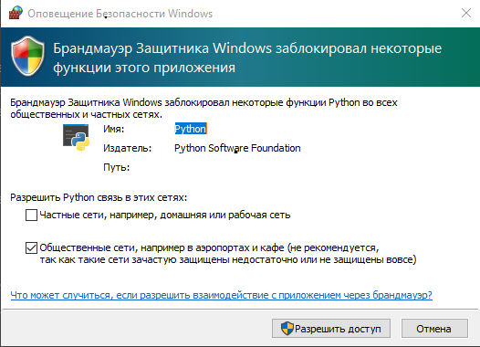

# 〈Minesweeper〉

## Описание
Многопользовательский сапёр, построенный на технологии [Network socket](https://en.wikipedia.org/wiki/Network_socket).
Поставляется как два независимых модуля: client (клиентская часть с собственно GUI, написанном на PyQt5) и
server (серверная часть с базой данных игроков и логами).
Оба модуля полностью независимы и при желании их можно разделить: на одном ПК только папка server (серверная часть),
на другом - client (клиентская часть). В таком случае необходимо изменить IP в main.py на реальный IP адрес, 
компьютера, на котором запущена клиентская часть.

## Руководство пользователя
1) Установить все библиотеки из requirements.txt;
2) Сначала запустить server.py из server. Рекомендуется запускать server.py из проводника, а не из PyCharm'а,
   т.к. в нем не работает ctrl-C и невозможно корректно завершить server.py (Завершается он, если что, с помощью ctrl-C.
   Вы увидите сообщение "STOP SERVER"). Затем main.py (его можно в PyCharm'е);
3) При первом запуске появится Оповещение безопасности Windows. Как и при работе с Flask это необходимо
   для общения по сети. Нажмите "Разрешить доступ". ~~Ну или же вручную добавьте правило в брандмауэре (не рекомендуется)~~.
   
   

## Features
- Хеширование паролей с помощью **bcrypt**;
- Все общение между клиентом и сервером осуществляется с помощью Network socket и **pickle** для сериализации данных;
- Логирование данных с помощью библиотеки **Loguru** (см. server.py);
- Самая классная фича, как мне кажется, - динамическая подкачка еще не загруженных фото (аватарок) игроков.
  Чтобы понять, о чем речь, см. исходных код. Если коротко: на клиенте в директории client/src/images/players_img хранятся
  уже загруженные фото игроков, а также dumb-файл (при первом запуске они отсутствуют, но при нажатии на кнопку
  "Рекорды" в самой игре, Вы увидите, что фото подгрузились и добавились в дамп-файл). Дамп-файл также засериализован
  с помощью **pickle**. Вообще, рекомендую посмотреть 146 строчку в server.py и
  соответствующую функцию из connection.py.
  Для проверки работоспособности такой системы в бд уже хранятся несколько пользователей и рекордов.
  После нажатия на "Рекорды" они должны подгрузиться;
- Красивый GUI;
- Сложности хранятся в БД на сервере, если их названия, например, или конфигурацию мин захочется поменять.
